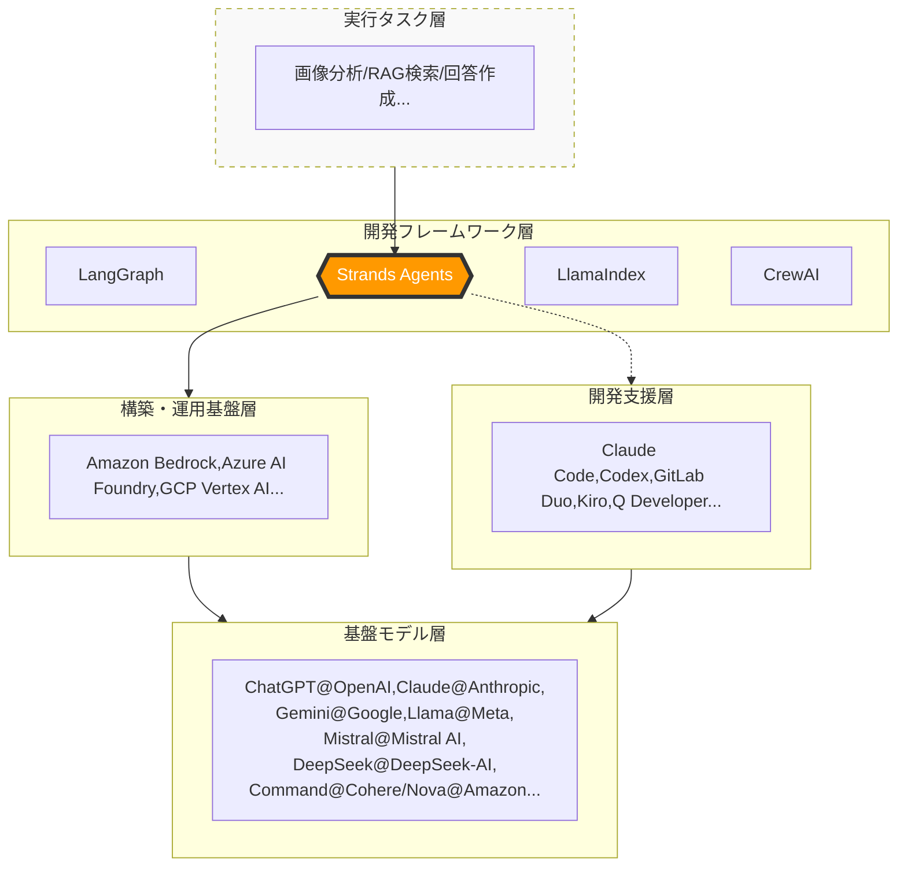

# 概要

Amazon Bedrockは、AWS（Amazon Web Services）が提供する、**生成AIアプリケーションを構築・運用するためのフルマネージド型プラットフォーム（構築・運用基盤）**　です。

- AgentCore
- ナレッジベース
- エージェント
- プロンプトマネージメント
- ガードレール
- フロー
- 自動推論
- データオートメーション

単一のAIモデルを提供するのではなく、世界中の優れたAIモデルをひとつの窓口で利用でき、さらに企業のデータと安全に連携させるための機能が統合されています。

# Amazon Bedrockの位置づけ

現在、AI関連サービスの世界では、次々と新しいツールが登場し、それぞれの役割や位置づけを把握するのが難しくなっています。ITエンジニアであっても、全体像を見失いがちな状況です。

そこで本書では、AIサービスの全体像をつかむために、関連技術やサービスを 5つのレイヤー構造に整理しています。

[AIサービスエコシステムの5つのレイヤー]

- **実行タスク層** : 具体的なビジネス上の目的と業務プロセスの定義
  
- **開発フレームワーク層**: プログラム言語上でのエージェントの推論と状態遷移の設計

- **開発支援層**: AI支援ツールやSDKを活用し、実装の工数を最小化してエージェントの振る舞い（ロジック）の定義に集中

- **構築・運用基盤層**: 安全な実行環境、データ連携、およびマネージドなオートメーションの提供

- **基盤モデル層**: 思考・判断のコアとなる大規模言語モデル（LLM）の提供

# Bedrockの主要な3つの特徴

### 複数の基盤モデル（FM）を選択可能

特定のメーカーのモデルに縛られず、用途に合わせて最適な「脳」を切り替えて使えます。

* **Anthropic**: Claudeシリーズ（高性能、プログラミング、自然な対話）

* **Meta**: Llamaシリーズ（オープンソース系のデファクトスタンダード）

* **Mistral AI**: Mistral / Mixtral（効率的で高性能）

* **Amazon**: Nova / Titan（AWS最適化、マルチモーダル対応）

* **Stability AI**: SDXL（画像生成）

### 企業データの安全な活用

入力したデータが**モデルの学習に再利用されることはありません。** また、AWSの既存のセキュリティ設定（IAMやVPC）がそのまま使えるため、エンタープライズレベルの安全性が確保されています。

### 開発を加速させる「統合機能」

モデルを呼び出すだけでなく、業務に組み込むための高度なツールが揃っています。

* **Knowledge Bases**: 自社ドキュメントを読み込ませるRAG（検索拡張生成）の自動化。

* **Agents**: AIが自分で考え、外部APIを叩いてタスクを実行。

* **Guardrails**: 不適切な発言や機密情報の露出をブロック。

# Bedrockの構成コンポーネント

Bedrockを「実行基盤」として機能させている主要なサービス群です。

| コンポーネント名            | 技術的役割・機能概要                                                                            | カテゴリ                    |
| ------------------- | ------------------------------------------------------------------------------------- | ----------------------- |
| Agents              | 【自律タスク実行】 ユーザーの目的を理解し、自らタスクを分解。ナレッジ検索や外部API（Action Groups）を駆使して複雑な業務を完結させる。       | 実行 (Execution)          |
| Flows               | 【ワークフロー自動化】  複数のプロンプトやLambda、条件分岐を視覚的に繋ぎ、定型的な業務プロセスを確実に実行するオーケストレーター。             | 進行 (Orchestration)      |
| Knowledge Bases     | 【RAG（検索拡張生成）】  社内ドキュメントをベクトル化して統合。AIがモデルの学習データにない「最新の事実」に基づいて回答するための外部知識基盤。       | 知識 (Data/Knowledge)     |
| Automated Reasoning | 【数学的・論理的検証】  AIの回答がビジネスルールや数式と矛盾していないか、数学的手法（形式手法）を用いて厳格にチェックする検算エンジン。            | 論理 (Logic/Verification) |
| Guardrails          | 【安全・ポリシー制御】  不適切な表現、個人情報の流出、特定のトピックをリアルタイムで監視・遮断し、安全なAI利用を担保するフィルタリング機能。          | 安全 (Safety/Security)    |
| Prompt Management   | 【プロンプト管理】  プロンプトをアプリケーションコードから分離し、コンソール上でバージョン管理、比較、テストを可能にする管理用レポジトリ。            | 管理 (Management)         |
| Data Automation     | 【マルチモーダル変換】  PDF、画像、動画などの非構造化データを解析し、AIが処理しやすい構造化データ（JSON等）に自動変換するパイプライン。         | 変換 (Ingestion)          |
| AgentCore           | 【推論・計画エンジン】  高度な推論（Reasoning）と行動計画（Acting）を司る、Bedrockエージェントの思考プロセスと制御ロジックの核となる部分。 | 心臓部 (Core Engine)       |

# なぜBedrockが選ばれるのか（ユースケース）

 - **社内ナレッジ検索（RAG）**:
	 - 大量の社内規定やマニュアルをAIに読み込ませ、社員からの質問に正確に答えさせる。

- **業務プロセスの自動化**: 
	- 請求書の読み取り（Data Automation）から、内容の照合（Agents）、矛盾チェック（Automated Reasoning）までを一貫して自動化。

- **マルチエージェント連携**:
	- 異なる得意分野を持つ複数のAI（Agents）を連携させて、複雑なプロジェクト管理や開発を行う。

