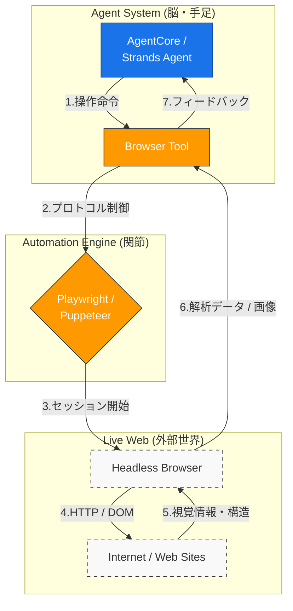

AWS Bedrock AgentCoreにおける**Browser（ブラウザ）** は、AIエージェントがWebサイトを閲覧、操作、情報抽出するために提供される **「マネージドな内蔵ツール」** です。

これまで、エージェントにWebアクセスをさせるには自前でPuppeteerやPlaywrightの実行環境を構築する必要がありましたが、BrowserツールはそのすべてをAWS側で完結させます。

- **Puppeteer**: Googleが開発した、Chrome/Chromiumの操作に特化したシンプルで高速な自動化ツール。

- **Playwright**: Microsoftが開発した、複数ブラウザ（Safari/Firefox等）や多言語に対応した高機能な次世代型テスト・自動化ツール。

> **AgentCore ブラウザ**は、AIエージェントにとって「API」でも「プラグイン」でもありません。むしろ、それは**エージェント自身が乗り込み、操縦する“ロボット（機体）”のような存在**です。  

# 概要

AIエージェントが、**「今、現在の動的なWeb情報」** にアクセスするためにはブラウザが必要です。しかし、商用環境での実装には以下の課題がありました。

- **インフラの複雑さ:** ヘッドレスブラウザの実行には大量のメモリを消費し、管理が困難。

- **セキュリティ:** 悪意のあるサイトへのアクセスや、ブラウザの脆弱性を突いた攻撃からの保護が必要。

- **可視性:** エージェントが裏で何を見たのか、どのボタンを押したのかを追跡できない。

AgentCore Browserは、これらを **「隔離された安全なブラウザセッション」** として提供し、エージェントにWebブラウジング能力を即座に与えます。

- **インターフェースの変換**: エージェント（AI）が直接理解できない「HTML/CSS/JS」というカオスな世界を、`Browser Tool` が「テキストデータ」や「スクリーンショット」に変換し、AIが理解できる形式に整えています。

- **サンドボックス（隔離環境）**: `Headless Browser`（画面のないブラウザ）は、エージェント専用の安全な作業部屋です。ここでセッションを維持し、クッキーやログイン状態を管理します。

- **自律的なフィードバックループ**: エージェントは一度の命令で終わりではなく、「サイトを開く → 状況を見る → ログインボタンを探す → クリックする」というループを、この図の **1番から7番まで** ぐるぐる回しながら目的を達成します。

# ブラウザはAPIではない

BedrockのAgentCoreにおけるブラウザ機能は「ブラウザそのもののAPI」というより、**「AIエージェントが、人間と同じようにウェブサイトを見て操作するための『目と手』を与えるインターフェース」**　です。

### ブラウザ機能の正体

これは、AIがインターネット上の情報を検索するだけでなく、**「JavaScriptで動く動的なサイトを操作する」「ログインが必要なページからデータを取る」「クリックや入力を行う」**　といったアクションを、AgentCoreの推論プロセスの中に組み込むためのものです。

### 実装の役割分担

内部的には、先ほど挙げられた **Playwright** などの技術が使われていますが、開発者から見たイメージは以下のようになります。

| **要素**                 | **役割**                                        |
| ---------------------- | --------------------------------------------- |
| **AgentCore (脳)**      | 「このサイトで航空券を予約して」という指示を受け、操作手順を考える。            |
| **ブラウザツール (目と手)**      | 指定されたURLを開き、DOM構造を解析し、AIが理解できるテキストや画像に変換して返す。 |
| **Playwright等 (エンジン)** | 実際にヘッドレスブラウザ（画面のないブラウザ）を背後で動かす実務担当。           |

### 「API」か「ブラウザ」かの境界線マトリクス

| **比較項目**   | **API（Application Programming Interface）** | **ブラウザ（Browser Automation）** |
| ---------- | ------------------------------------------ | ---------------------------- |
| **主要な用途**  | データの取得、システム間の命令転送                          | 人間向けUIの操作、非公開情報の収集           |
| **データの性質** | **構造化データ**（JSON/XMLなど）                     | **非構造化データ**（HTML/画像/DOM）     |
| **実行速度**   | **高速**（HTTPリクエストのみ）                        | **低速**（画面描画やJS実行を待機）         |
| **安定性**    | **高い**（仕様が変わらない限り動く）                       | **低い**（UIデザイン変更で壊れやすい）       |
| **コスト**    | 低（リソース消費が少ない）                              | 高（メモリやCPUの消費が激しい）            |

### APIで十分な（APIを優先すべき）ケース

システム側に「エージェント（外部プログラム）用の窓口」が用意されている場合です。

- **公式サービス連携**: Slack, GitHub, Salesforceなど、公式APIが提供されている場合。

- **構造化された情報の取得**: 株価、天気、社内DBの検索など、決まったフォーマットで返ってくるもの。

- **確実性が求められる操作**: 決済、ユーザー削除、設定変更など、誤操作が許されないクリティカルな処理。

### ブラウザが必要なケース

「人間が画面を見て操作すること」しか想定されていない環境に、エージェントを送り込む場合です。

- **API未提供のサイト**: 競合他社のECサイトの価格調査や、古い社内システム（レガシーシステム）の操作。

- **動的コンテンツの解析**: JavaScriptを実行しないと中身が表示されないモダンなWebサイト。

- **視覚情報の確認**: 「バナー広告が正しく表示されているか」「レイアウトが崩れていないか」といった、人間的な確認が必要なタスク。

- **ログイン・多段階操作の突破**: APIでは認証が複雑すぎて突破困難だが、画面からならID/PW入力で済む場合。

# ブラウザはプラグインでなない

**「ブラウザ」はエージェントにとっての「プラグイン」ではなく、エージェントが乗り込んで操縦する「ロボット（機体）」**　のようなものです。

### なぜ「UI（画面）」がないのにブラウザなのか？

私たちが普段使っているブラウザ（Chromeなど）から、**「描画機能（画面に絵を出す処理）」だけを剥ぎ取ったもの**を「ヘッドレスブラウザ」と呼びます。

- **API**: データの「中身」だけをやり取りする専用窓口。

- **ブラウザ（ヘッドレス）**: 画面は見えないが、内部では「どこにボタンがあるか」「このスクリプトを動かすとどうなるか」という**UIの構造そのものをエージェントが処理している**状態。

つまり、エージェントは画面を「見て」いるのではなく、画面の「設計図（DOM）」を直接触って操作しているのです。

### 「ブラウザのプラグイン」との違い

「プラグイン」と比較すると、役割が逆転しています。

- **ブラウザのプラグイン**: ブラウザ（主）に、特定の機能（従）を付け足すもの。

- **エージェントのブラウザ実装**: エージェント（主）が、ブラウザという道具（従）を**外側から操る**もの。

エージェントがブラウザを使うのは、**「API（裏口）がないから、UI（表玄関）から無理やり入るため」**　という消去法的な理由が多いです。

# 実装のポイント

- **インフラ管理の不要:** `BrowserTool` を使うことで、ブラウザ実行用のサーバーを自前で用意する必要がなくなります。

- **高度な操作ロジック:** `browser-use` の「DOMを解釈して自律的に動く」という強力な機能を、そのままAWS基盤に持ち込めます。

- **可視性の確保:** AgentCoreの機能（Session Replayなど）と組み合わせれば、`browser-use` が裏で何をしたかをビデオで確認できるようになります。

# まとめ

この構成により、以下の「商用レベルのWeb操作」が完成します。

- **インフラ管理の不要:** `BrowserTool` を使うことで、ブラウザ実行用のサーバーを自前で用意する必要がなくなります。

- **高度な操作ロジック:** `browser-use` の「DOMを解釈して自律的に動く」という強力な機能を、そのままAWS基盤に持ち込めます。

- **可視性の確保:** AgentCoreの機能（Session Replayなど）と組み合わせれば、`browser-use` が裏で何をしたかをビデオで確認できるようになります。

