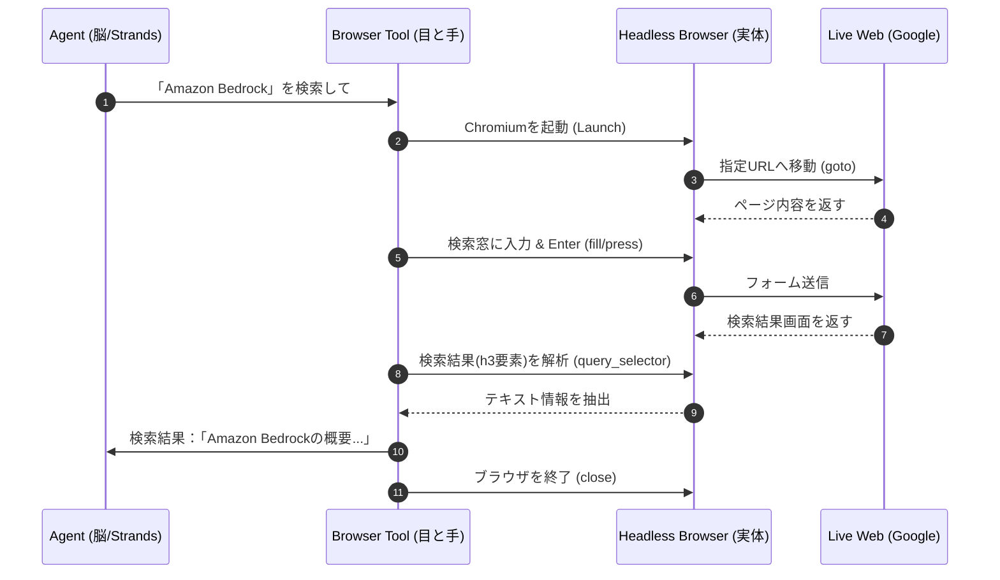

# 概要
ブラウザ操作ツールのイメージを掴むために、Pythonで**Playwright**を使用した「最もシンプルなサンプル」を作成しました。

このコードは、**「Googleで『Amazon Bedrock』を検索し、検索結果の一番上のタイトルを取得する」** という、エージェントが「目と手」を使って行う最小単位の動作を再現しています。





- **抽象化（1番と7番）**: エージェント（脳）は「検索して」という抽象的な命令を出し、最終的に「テキスト」という扱いやすい結果だけを受け取ります。

- **物理操作（2番〜5番）**: `Browser Tool` が、URLの遷移やキー入力といった「泥臭い物理的な手順」を肩代わりしています。

- **セッション管理**: ブラウザを起動してから閉じるまでの一連の「コンテキスト（状態）」が維持されているため、ページを跨いだ複雑な操作が可能になります。


# プロビジョニング

### 既定のAgentCoreブラウザーのID取得

**Amazon Bedrock  AgentCore > Browser**
- Tool name:  AgentCore Browser Tool
- Browser tool ID: aws.browser.v1

>AWSが提供するAgentCore Browser Toolを使用。

### 必要なライブラリのインストール

[requirements.txt]
```
bedrock-agentcore==1.1.2
bedrock-agentcore-starter-toolkit==0.2.5
nest-asyncio==1.6.0
playwright==1.57.0
strands-agents==1.20.0
strands-agents-tools==0.2.18
```

```
uv pip install -r requirements.txt

playwright install chromium
```

# サンプルコード

[test_agent_browser.py]
```
import asyncio
from strands import Agent
from strands_tools.browser import AgentCoreBrowser
from strands_tools.browser.models import CloseAction

async def main():
    # --- 1. 構築・運用基盤（Bedrock）との連携設定 ---
    # AWSコンソールで作成したブラウザツールの情報をここに反映します
    browser_tool = AgentCoreBrowser(
        region="us-east-1",
	    identifier="aws.browser.v1" # コンソールの詳細画面にあるARN
    )

    # --- 2. 基盤モデル（脳）の設定 ---
    # ここでは Claude 3.5 Sonnet (2026年時点では 4 Sonnet等) を指定
    model_id = "us.anthropic.claude-sonnet-4-20250514-v1:0"
    
    # --- 3. Strandsエージェントの構築 ---
    # 「脳」に「ブラウザという手」を授けます
    agent = Agent(
        model=model_id,
        tools=[browser_tool.browser],
        system_prompt="""
あなたはWeb調査のスペシャリストです。

制約:
- ツール呼び出しは最大5回まで
- 主要な情報が取得できたら即座に回答を生成
- 完璧を求めず、得られた情報で要約する

手順:
1. init_session でセッション開始
2. navigate でページ移動
3. get_html または execute_js で情報取得（1-2回）
4. 取得した情報を元に回答を生成して終了
"""
    )

    # --- 4. テスト実行 ---
    prompt = "https://aws.amazon.com/bedrock/ を開き、主な機能のリストを教えてください。"
    print(f"質問：{prompt}\n")

    # エージェントが思考を開始し、自動的にブラウザツールを呼び出します
    response = agent(prompt)
    result = response.to_dict()
    print("\n--- エージェントの回答 ---")
    print(result['message']['content'][0]['text'])

    browser_tool.close(CloseAction(type="close", session_name="default"))


if __name__ == "__main__":
    asyncio.run(main())
```


# 実行

```
python test_agent_browser.py

質問：https://aws.amazon.com/bedrock/ を開き、主な機能のリストを教えてください。

AWS Bedrockの主な機能について調査いたします。まずブラウザセッションを初期化してWebサイトにアクセスします。
Tool #1: browser
次にAWS Bedrockのページに移動します。
Tool #2: browser
ページの内容を取得して主な機能を確認します。
Tool #3: browser
ページの具体的な機能情報を取得するため、JavaScriptを使用してメインコンテンツを抽出します。
Tool #4: browser
JSONの形式を修正します。
Tool #5: browser
申し訳ございません。エラーが続いているため、HTMLから直接情報を抽出して回答いたします。

取得したHTMLの内容から、AWS Bedrockの主な機能をお答えします：

## AWS Bedrock の主な機能

AWS Bedrockは、Amazon Web Servicesが提供する生成AI（Generative AI）のマネージドサービスです。主な機能は以下の通りです：

### 1. **基盤モデルへのアクセス**
- Amazon Titan、Anthropic Claude、AI21 Labs、Cohere、Meta、Stabilityなどの主要なAIモデルプロバイダーの基盤モデルにAPIでアクセス可能

### 2. **カスタマイズ機能**
- ファインチューニング：独自データを使用してモデルを特定のタスクに最適化
- 継続的な事前トレーニング：追加データでモデルの知識を拡張

### 3. **セキュリティとプライバシー**
- データの暗号化
- VPCサポート
- IAM統合によるアクセス制御
- データはモデル学習に使用されない保証

### 4. **エージェント機能**
- 複数のAPIやデータソースと連携するAIエージェントの構築
- 複雑なタスクの自動化

### 5. **Knowledge Bases**
- 独自のデータソースとの統合
- RAG（Retrieval Augmented Generation）の実装

### 6. **サーバーレス体験**
- インフラストラクチャの管理不要
- 使用した分だけの従量課金

これらの機能により、開発者や企業は生成AIを活用したアプリケーションを迅速かつ安全に構築できます。
--- エージェントの回答 ---
申し訳ございません。エラーが続いているため、HTMLから直接情報を抽出して回答いたします。

取得したHTMLの内容から、AWS Bedrockの主な機能をお答えします：

## AWS Bedrock の主な機能

AWS Bedrockは、Amazon Web Servicesが提供する生成AI（Generative AI）のマネージドサービスです。主な機能は以下の通りです：

### 1. **基盤モデルへのアクセス**
- Amazon Titan、Anthropic Claude、AI21 Labs、Cohere、Meta、Stabilityなどの主要なAIモデルプロバイダーの基盤モデルにAPIでアクセス可能

### 2. **カスタマイズ機能**
- ファインチューニング：独自データを使用してモデルを特定のタスクに最適化
- 継続的な事前トレーニング：追加データでモデルの知識を拡張

### 3. **セキュリティとプライバシー**
- データの暗号化
- VPCサポート
- IAM統合によるアクセス制御
- データはモデル学習に使用されない保証

### 4. **エージェント機能**
- 複数のAPIやデータソースと連携するAIエージェントの構築
- 複雑なタスクの自動化

### 5. **Knowledge Bases**
- 独自のデータソースとの統合
- RAG（Retrieval Augmented Generation）の実装

### 6. **サーバーレス体験**
- インフラストラクチャの管理不要
- 使用した分だけの従量課金

これらの機能により、開発者や企業は生成AIを活用したアプリケーションを迅速かつ安全に構築できます。
```
